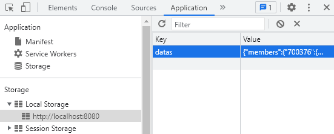

# Advent of Code leaderboard visualizer

Display day to day leaderboard of the advent of code.

## How to make it works ?

- Clone the project and cd in the project
- Run in command line `npm start`
- Copy the data from your leaderboard of the advent of code
```
https://adventofcode.com/[year]/leaderboard/private/view/[leaderboard_id].json
```
*PS: You can find your private leaderboards [right here](https://adventofcode.com/2021/leaderboard/private).
Also you can click on view and add `.json` at the end of the url.*
- Set manually in the local storage of the webapp `datas` equal to what you copied

- Refresh the browser